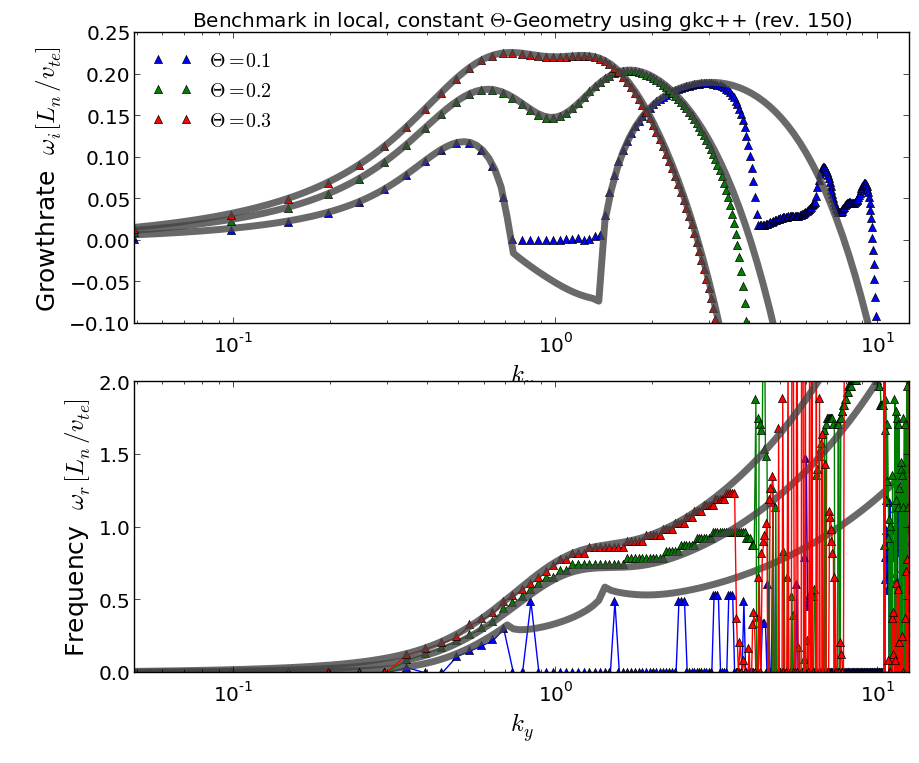
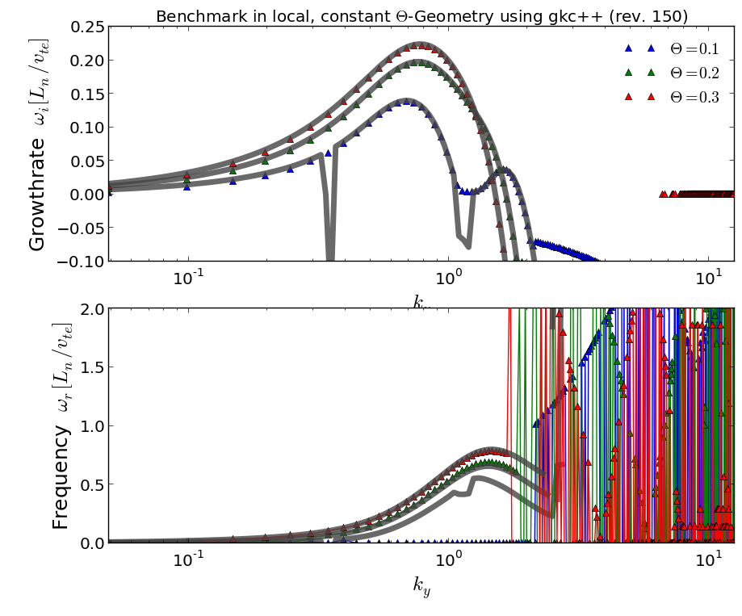

Benchmark using local, constant-theta geometry
===============================================

  Note : Needs cleanup

This geometry is a shearless, slab geometry. The parallel
direction has a constant angle to the equilibrium magnetic field
along the radial domain (x). Thus the parallel wavenumber, which
governs the Landau damping is $ k_\prallel = \Theta k_y$.
This geometry is used e.g. in  Nakata and Watanabe.

Benchmark
____________

For the Benchmark, we fix $k_x = 0$, $\eta=6$ and $\theta = [0.1, 0.2, 0.3]$,
calculated growthraes and frequency theoretically and comparing to the results
as given by gkc++. We compare full order, as well as first order gyro-kinetic
effects.

Results
_________

Load the data file with gkcAna and type in
plotFrequencyGrowthrates(fileh[0]), the results shows
you the corresponding growthrates

## Benchmark results (Full order)

## Benchmark results (First order)

