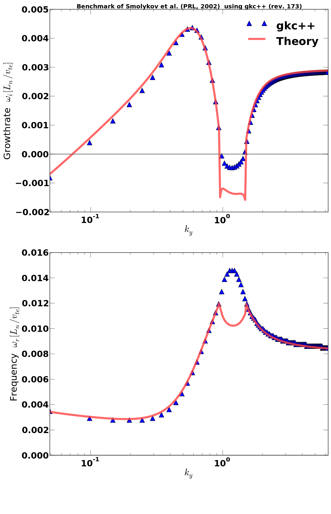
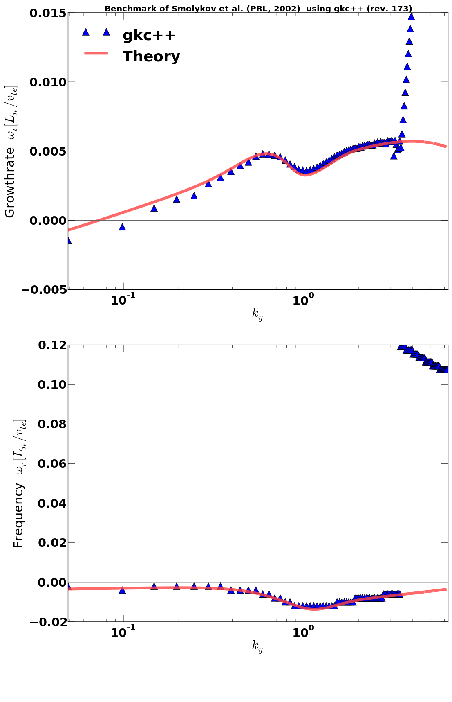
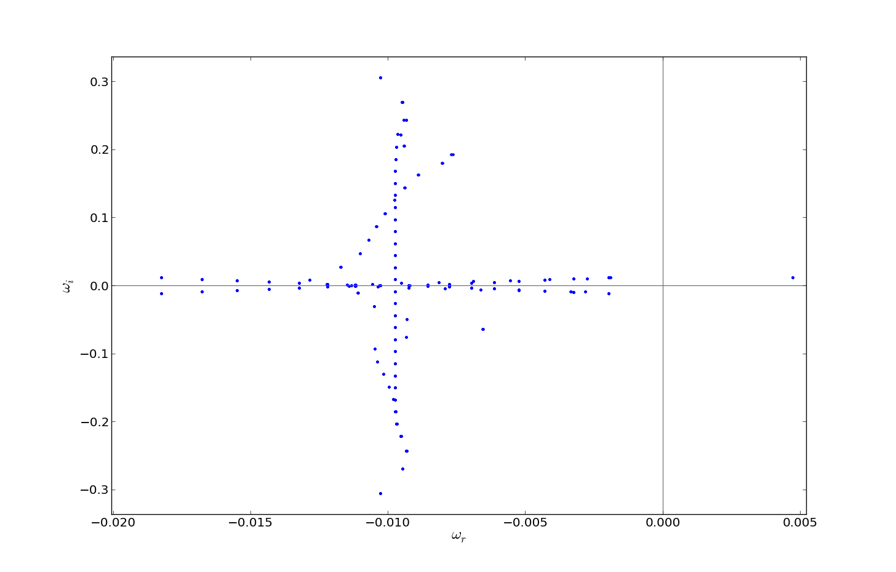

Benchmark using local, sheareless slab geometry
===============================================

  Note : Needs cleanup

This geometry is a shearless, slab geometry. The
parallel wavenumber accounting for the Landau
damping is set directly by $k_\parallel = k_z$.

We reproduce Smolyakov et al. results, wo found
the short-wavelength mode behaviour.

Benchmark
____________

Using this test, we benchmark the gyro-averaging modules,
as well as the inclusion of kinetic species.

Additionally, we use the eigenvalue solver to find
that the short-wavelength branch is indeed the ITG-sw
branch and does not account from the ETG.

Results
_________

## Benchmark results (with adiabatic electrons)

## Benchmark results (with kinetic wlectrons)

## Benchmark results (Eigenvalues solver resolved ETG and ITG mode)

